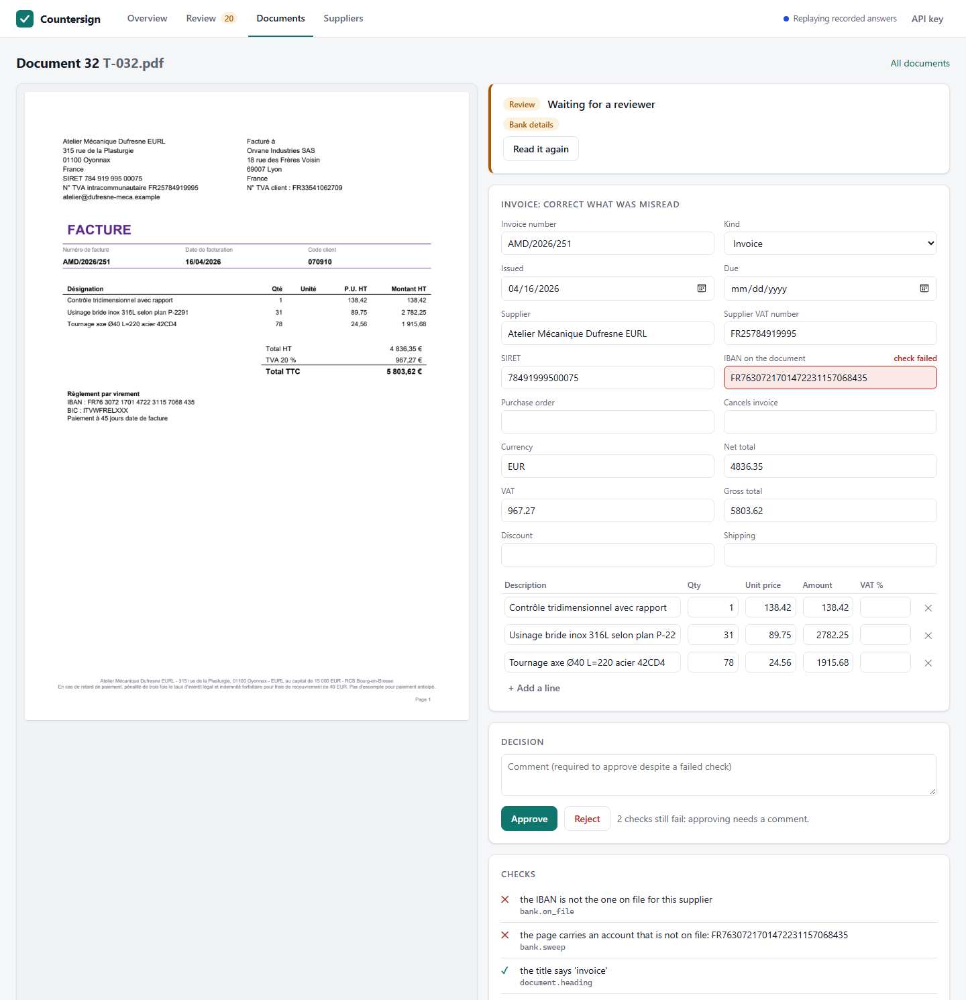
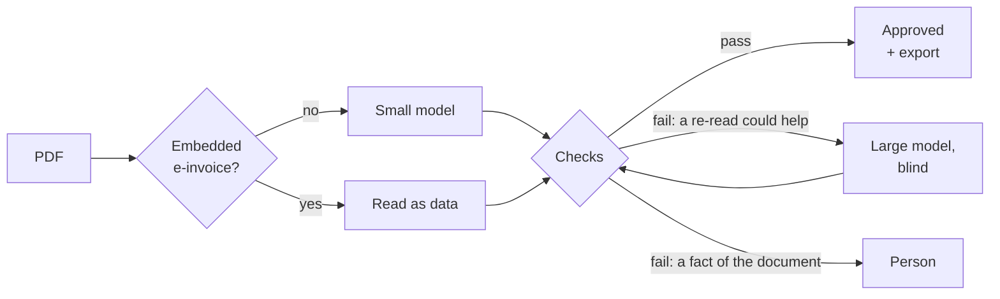
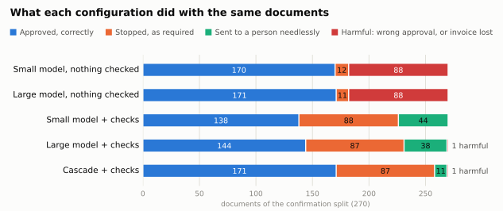
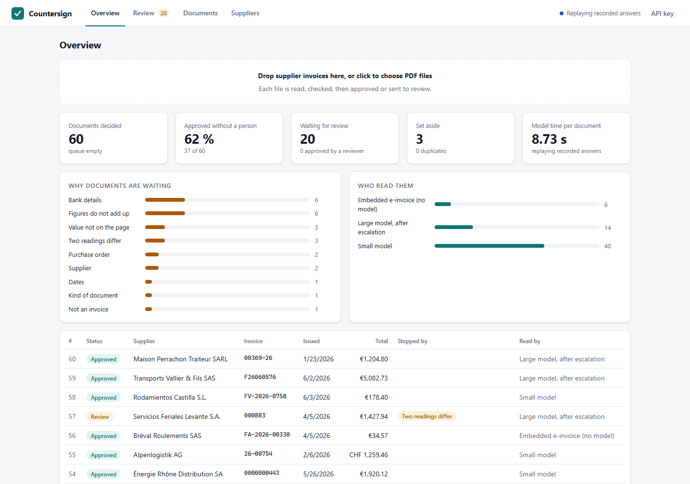

# Countersign

[](https://github.com/KhalilBenGaied66/Countersign/actions/workflows/ci.yml)

Supplier-invoice intake in which a local model reads the document, deterministic
checks countersign what it read, and a person sees whatever could not be verified.

**Stack.** Python 3.11+, FastAPI, Pydantic, SQLAlchemy 2 with Alembic (SQLite or
PostgreSQL), two open-weight Qwen models served by Ollama, pypdf and PDFium, Prometheus,
OpenTelemetry, Docker, GitHub Actions.



> **Context.** Orvane Industries is a fictional company. Its suppliers, invoices and
> purchase orders are generated for this prototype, and no real user has tried it.
> The measurements below are real: two open-weight models, on one consumer GPU, on
> documents built to be read wrongly.

## What it does

| A document arrives | What happens | Model calls |
|---|---|---|
| A hybrid e-invoice (Factur-X, ZUGFeRD) | The embedded XML is read as data and checked against the visible page | 0 |
| A PDF invoice with a text layer | The small model reads it; every check passes; approved and exported | 1 |
| An invoice the small model misreads | A check fails; the large model reads the document again, without being told why | 2 |
| An invoice with a bank account that is not the one on file | Stopped for a person. A second model would read the same account | 1 |
| A scan | Read from the page image by both models; approved only if they agree | 2 |
| A quote, a pro forma invoice | Set aside, when its own title or a second reading says the same | 1 or 2 |
| A copy of an invoice already taken in | Set aside, when nothing else is wrong with it | 1 |

Three rules hold the design together:

- **The model reads, code decides.** A model fills a form. It has no tool, takes no
  decision, and is never asked how confident it is.
- **Nothing is trusted because a model said it.** Every value is compared with
  something the model does not control: arithmetic, a checksum, the text of the page,
  the vendor master, the order book. An IBAN is also searched for on the page by
  pattern, so that a model which overlooks it, or is told to, cannot hide it.
- **In doubt, a person.** And the payment always goes to the account on file, never to
  the one printed on the invoice.



## Measured

<!-- results:start -->
Two sets of 270 documents were each run once, live, on documents the code had never
met. Why two, and everything they found, is in [docs/evaluation.md](docs/evaluation.md).
The second one, as it ran:

<!-- table:configurations:confirm-run -->
| Configuration | Harmful decisions (wrong approvals + invoices lost) | Approved without a person, of those that can be | Stopped, of those that must be | Read with every critical field right | Model time per document | per clean document |
|---|---|---|---|---|---|---|
| Small model, nothing checked | 88 (85 + 3) | 93.4 % (170/182) | 13.6 % (12/88) | 91.9 % (237/258) | 7.2 s | 7.9 s |
| Large model, nothing checked | 88 (84 + 4) | 94.0 % (171/182) | 12.5 % (11/88) | 91.5 % (236/258) | 10.9 s | 12.0 s |
| Small model + checks | 0 (0 + 0) | 75.8 % (138/182) | 100.0 % (88/88) | 91.9 % (237/258) | 7.2 s | 7.9 s |
| Large model + checks | 1 (1 + 0) | 79.1 % (144/182) | 98.9 % (87/88) | 91.5 % (236/258) | 10.9 s | 12.0 s |
| **Cascade + checks** | 1 (1 + 0) | 94.0 % (171/182) | 98.9 % (87/88) | 94.2 % (243/258) | 11.7 s | 12.9 s |
<!-- /table -->

<picture>
  <source media="(prefers-color-scheme: dark)" srcset="docs/img/outcomes-dark.svg">
  
</picture>

- **Across the two runs the cascade with checks made 3 wrong approvals in 540
  documents** and set no real invoice aside. The same small model with nothing checked
  made 91, then 88, harmful decisions.
- It approved 344 of the 365 documents a correct system approves, and stopped 172 of
  the 175 it had to stop.
- **The three failures are in the repository, not under the carpet.** All three are
  invoices their supplier got wrong: two with VAT at half its rate, on pages where the
  check had nothing to compare it with, and one whose misprinted line the second model
  tidied. Both causes were closed afterwards. Recomputed on the same recorded answers,
  the current code makes none: that is a regression test, not a measurement, and the
  two are kept apart.
- A typical document takes about 6 s of model time on one consumer GPU (the median);
  one in four is read twice.
<!-- results:end -->

## Try it

Python 3.11 or later and [uv](https://docs.astral.sh/uv/). No GPU is needed for any of
this: the model answers of the evaluation are recorded in the repository and replayed.

```bash
uv sync
```

Run the application on sixty documents of the test split, then open
http://127.0.0.1:8000:

```bash
uv run countersign demo
```



Reproduce the numbers, and prove the committed reports are current:

```bash
uv run python -m countersign.eval.gate
```

Run the tests:

```bash
uv run pytest
```

### With your own GPU

With [Ollama](https://ollama.com) running and the two models pulled (`qwen3.5:4b`,
`qwen3.5:9b`, about 10 GB of video memory together):

```bash
uv run countersign serve
```

```bash
uv run python -m countersign.eval.run --split dev --config cascade --record
```

Other commands, configuration and what to watch in production are in
[docs/operations.md](docs/operations.md).

## What was run, and what was not

<!-- status:start -->
| | State |
|---|---|
| The three splits, live on an RTX 5060 Ti with both models | **Run.** dev many times while developing; test once; confirm once. Every answer is recorded |
| Reports recomputed from the recordings (`eval.gate`) | **Run.** 20 reports, identical to the committed ones and within their limits, on Windows and on Linux (CI) |
| Test suite | **Run.** 788 tests on Python 3.11 and 3.13, on Windows and on Linux (CI), coverage 96.7 % |
| Lint, formatting, strict typing | **Run.** ruff and mypy, clean |
| Storage, queue, API and command-line tests on PostgreSQL | **Run** against PostgreSQL 17, locally and in CI: 137 tests pass |
| Review console | **Run** in a browser on recorded answers: review, correct, approve with a comment, reject. Its script is also tested under Node |
| Install without development dependencies, then `countersign demo` | **Run** from the built wheel, in a clean environment on Windows |
| Docker image, `docker compose` | **Run** in CI only: the image is built, processes forty recorded documents and refuses to listen without keys, and the compose file starts its demo profile. The `live` profile, which needs a model server, has **never** run |
| GitHub Actions workflow | **Run** on every push: tests on two Python versions, the evaluation gate, the database tests, the container. Its first run was the first on Linux, and passed |
| Linux | **Run** in CI only (Ubuntu). The development machine runs Windows; nothing was run on macOS |
| Trace export (OTLP/HTTP) | **Run** in the test suite: the exporter sends to a local receiver, which decodes what arrives. **Never** pointed at a real collector (Jaeger, Tempo) |
| Real invoices, real users | **None.** See [docs/production.md](docs/production.md) |
<!-- status:end -->

## Repository

```
src/countersign/
  parsing/     PDF text, title and page images, embedded e-invoice (hardened XML)
  llm/         model client, record/replay cassette, versioned prompts
  domain/      extraction schema, number and date parsing, identifier checksums
  verify/      evidence read from the page without a model, and the checks
  pipeline/    locale inference, the cascade, the decision
  store/       tables, migrations, the queue, the document life cycle, the outbox
  api/  web/   HTTP API, the guard in front of it, the review console (plain JavaScript)
  obs/         JSON logs, Prometheus metrics, OpenTelemetry spans
  eval/        scoring, evaluation runs, reports, regression gate, figure
  datagen/     generator of the synthetic dataset
data/          the dataset (640 PDFs with ground truth) and the reference data
evals/         recorded model answers, reports, thresholds, the first run's reports
docs/          problem, architecture, decisions, evaluation, security, operations
tests/         the test suite
```

## Documentation

1. [The problem](docs/problem.md): what the system is for, and what it must never do
2. [Architecture](docs/architecture.md): the pipeline, the checks, the queue, the storage
3. [Decisions](docs/decisions.md): twenty choices, what each one costs
4. [Evaluation](docs/evaluation.md): dataset, method, results, every failure, limits
5. [Security](docs/security.md): what can go wrong, what stands in the way, what does not
6. [Operations](docs/operations.md): run, configure, observe, recover
7. [Before real use](docs/production.md): what is missing

## How it was built

<!-- history:start -->
A personal prototype, written with Claude Code as a programming assistant, in this
order:

1. The prompt and the checks were developed on 100 documents, through five prompt
   versions, each measured.
2. The pipeline was frozen and run once on 270 documents it had never met.
3. Meanwhile two independent code reviews, which did not see that run, reported 48
   findings. All are fixed or listed as limits, each fix with its test.
4. The run had found a gap of its own. It was closed, and a second set of 270 new
   documents was generated and run once. It found another one, closed in turn.

[docs/evaluation.md](docs/evaluation.md) tells it with the numbers of each step.
<!-- history:end -->

## En français

Countersign est un prototype de traitement des factures fournisseurs. Un modèle de
langage local lit le document ; des contrôles déterministes (arithmétique, clés de
contrôle IBAN et SIRET, texte de la page, référentiel fournisseurs, commandes)
vérifient ce qu'il a lu ; ce qui ne peut pas être vérifié est présenté à une personne.
Le modèle ne décide de rien. Les résultats ci-dessus sont mesurés sur des documents
fictifs, avec deux modèles ouverts exécutés sur une seule carte graphique grand
public. La documentation est en anglais.

## License

[MIT](LICENSE), for the code and for the generated dataset alike.
