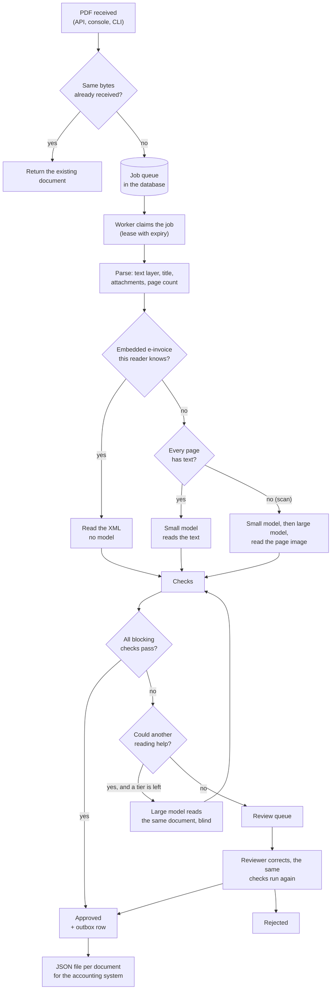

# Architecture

## One document, start to finish

Two outcomes are not drawn, because they set a document aside without anyone looking,
and each needs more than one reading to say so:

- **not an invoice**: the reading says so, and so does the title of the page or a
  second, independent reading;
- **duplicate**: same supplier, number, kind, total and date as a document already
  taken in, and every other check passes.

If anything else is wrong with the document, or if two readings disagree on what it
is, it goes to a person.

## Components

| Module | Role |
|---|---|
| `parsing/pdf.py` | Text layer (layout preserved), what the first page prints in large type, XML attachments, page images. Refuses oversized, encrypted or malformed files. |
| `parsing/einvoice.py` | Reads the Cross Industry Invoice XML of a hybrid e-invoice (Factur-X, ZUGFeRD) with a hardened parser. |
| `llm/client.py` | One call to the model server: constrained JSON output, timeouts, retries, and guards against the silent failures of local inference. |
| `llm/cassette.py` | Records model answers by request hash and replays them. |
| `llm/prompts/` | Versioned prompts, each tied to the JSON shape it asks for. |
| `domain/` | The two shapes of an extraction (as returned, as normalised), number and date parsing, identifier checksums and structures. |
| `pipeline/normalise.py` | Infers the decimal separator and the day/month order of the document, then parses. |
| `verify/evidence.py` | Index of what the page prints: numbers with their sign, dates, references, IBANs, order numbers, currencies, the title, labelled totals and dates. |
| `verify/checks.py` | The checks, each with its verdict on whether another reading could help. |
| `pipeline/process.py` | The cascade and the decision. |
| `master.py` | Vendor master, purchase orders, the buyer's own identifiers. |
| `store/` | Tables, migrations, the queue, the document life cycle, the outbox. |
| `worker.py` | Claims jobs and runs the pipeline. Stateless. |
| `api/` | HTTP API, the guard in front of it, and the static review console. |
| `obs/` | JSON logs, Prometheus metrics, OpenTelemetry spans. |
| `eval/` | Dataset format, scoring, evaluation runs, reports, regression gate. |
| `datagen/` | Generator of the synthetic dataset. Development only. |

## What the model is trusted with

Only with reading. A tier returns a `RawExtraction`: the fields of the form, as found
on the page. Everything after that is code:

- **Normalisation.** Dates are returned as printed and parsed here, because
  "03/04/2026" is April in Lyon and March in Chicago and the choice belongs to the
  document as a whole, not to one field. Identifiers are compacted. Amounts arrive as
  JSON numbers (see [evaluation.md](evaluation.md) for why not as text).
- **Checks.** None asks the model how sure it is. Each compares the extraction with
  something the model does not control.
- **Decision.** Approved if every blocking check passes, otherwise review; set aside
  only in the two cases above.

The model has no tool, no memory of other documents and no say in the outcome. An
instruction hidden in a document can change what the model reports, and nothing else.

## The checks

| Family | What is compared | Against |
|---|---|---|
| `arithmetic` | lines, allowance, charge, net, VAT per rate, gross; quantity × unit price; the sign of an invoice's total | each other |
| `arithmetic` | each total | the amount printed on the line of its label, when the label is known |
| `grounding` | invoice and order number, dates, currency, identifiers, totals with their sign; each line amount, on the row of its unit price | what the page prints |
| `supplier` | VAT number, SIRET | their checksums; the vendor master; the buyer's own identifiers |
| `buyer` | the page | the buyer's name and identifiers: the invoice must be addressed to it |
| `bank_details` | the IBAN reported, and every IBAN found on the page by pattern | its checksum and national structure; the account on file |
| `invoice_number` | the number | the supplier's numbering, digit widths included; the buyer's order numbering; the invoice a credit note cancels |
| `purchase_order` | the order reported, and every order number found on the page | existence, supplier, status, currency, amount |
| `duplicate` | supplier and number | documents already taken in, and documents a person rejected |
| `dates` | issue and due date | today and each other; the date printed after their own label; the day/month order of the supplier's country |
| `currency` | the currency | the supplier's currency on file |
| `document_type` | the kind reported | the title of the page |
| `not_invoice` | a reading that says "not an invoice" | the title of the page, or a second reading |
| `consensus` | a scan read by two models | each other |
| `extraction` | every value | parseable; amounts with two decimals at most |

Six of these are *sweeps* (accounts, order numbers, the title, labelled totals,
labelled dates, the addressee): they read the page by pattern, independently of the
model, so that an omission cannot hide what the page contains. A model that does not report
a second IBAN printed in white on white does not make it disappear.

Four rules hold across the list:

- **A reference is on the page as a whole or not at all.** "FA-2026-0018" is not
  printed on a page that says "FA-2026-00187".
- **A number is printed whole, or as part of a longer one.** In "12 345,00" a plain
  space may also separate two columns, so 345.00 is a possible reading; in "1'240.00"
  the apostrophe cannot, and 240.00 is not on the page.
- **A title is what the first page prints in large type**, whatever its case. On a page
  printed in one size it is a column in capitals among the first lines that starts
  with a known title.
- **Arithmetic does not pass for want of something to compare.** VAT that cannot be
  tied to a rate and a base fails; lines must add up to the net total even when one of
  them carries no amount. A sweep is different: outside its vocabulary it finds
  nothing, and neither passes nor fails.

### Escalation

A failed check carries a `retriable` flag. The rule behind it: **a value that is on
the page was at least copied from it**. A total that appears nowhere on the page is a
misreading, and a second model should try. An IBAN that is printed and differs from
the one on file is a fact about the document: the second model would read the same
IBAN, and the document goes straight to a person.

The second tier receives the same prompt and the same document, and nothing about the
first attempt. Telling a model which check it failed invites it to produce the sum it
is asked for rather than read the page.

A second reading that passes every check is accepted, with one exception: it may not
overrule an amount that the page prints as a number of its own. If two readings report
different printed values for the same total, or for the same line, the page prints two
candidates, and choosing between them is not for a model.

### Scans

A page that draws a picture the size of itself and carries no text is a scan, and one
such page makes the whole document one: grounding and the sweeps have nothing to work
on. In their place a scan is read by both tiers and approved only if they agree on
every critical field. It costs two model calls and is the same idea as double keying
in a data-entry shop. A configuration with a single tier approves no scan, and a scan
of more than one page goes to a person: two page images do not fit the model's window
next to its answer.

### Embedded e-invoices

The XML of a hybrid e-invoice is read without a model and put through the same checks,
the comparison with the visible page included. The reader declines what it does not
handle (a profile without line items, a document type other than invoice and credit
note): the page is then read by the models like any other.

## Queue

The queue is a table. That is enough for one node, removes a broker from the
deployment, and keeps a job and its document in one transaction.

- **Claim.** One `UPDATE ... WHERE id = (SELECT ... LIMIT 1) RETURNING id`. On
  PostgreSQL the sub-select carries `FOR UPDATE SKIP LOCKED`; the condition is repeated
  on the outer statement so that a row taken in between changes nothing.
- **Lease.** A claim sets `locked_until`. Nothing renews a lease, so it is as long as
  the slowest document can be: every tier, every retry, each running into its timeout
  (about 25 minutes with the defaults). A worker that dies leaves a lease that expires;
  the job becomes claimable again. Workers have names that never repeat, across
  processes too.
- **Retry.** A failed attempt goes back to `queued` with exponential backoff. After
  `max_attempts` the job is parked as `failed` and the document shows as failed in the
  console, from where it can be queued again.
- **What is retried.** A model server that is down or too slow for *any* reading the
  document needed fails the job, which is retried later: an outage is never turned
  into a review under another name. A model that cannot read the document is an
  outcome, not a failure: the document goes to review. A result the database refuses
  is a failure with its own error, and is not tried again.

Delivery is at-least-once. Processing is idempotent, and four things keep a repeated
or concurrent run harmless:

1. the content hash of the file is unique: the same upload is the same document;
2. a worker writes its result only if it still holds the lease and the document is
   still being processed;
3. every change of a document's state reads the row again under a lock and re-checks
   the state in the same transaction: two decisions sent at once cannot both succeed;
4. a partial unique index on (supplier, invoice number) for approved documents: two
   workers racing on two copies of an invoice cannot both approve it. The database
   refuses the second: an exact copy is set aside as a duplicate, anything else goes
   to a person.

## Storage

| Table | Content |
|---|---|
| `documents` | One row per file: status, the invoice as approved, and the full record of what the pipeline did (attempts, raw extractions, every check). |
| `jobs` | The queue. |
| `events` | Append-only audit trail: received, processed, approved or rejected by whom, with which corrections and which failed checks overridden. |
| `exports` | Outbox: one row per approved document, written in the approval transaction. |

Approval, its audit event and the outbox row are one transaction. The export file is
written after that transaction has committed, from the outbox, one JSON file per
document named by its id: delivering twice overwrites the same file, and a file never
exists for an approval that did not commit. A row may stay pending when the file
cannot be written; an idle worker delivers it later.

The export carries the IBAN **on file**, never the one printed on the invoice.

SQLite in WAL mode is the default, with transactions the application starts itself
(`BEGIN IMMEDIATE`): two of them never interleave. On PostgreSQL the same code relies
on row locks. The schema is owned by Alembic migrations.

## Processes

`countersign serve` runs the API, the console and the workers in one process, which is
what a single GPU needs. `countersign serve --no-workers` and `countersign worker` split
them. Workers hold no state: everything is in the job row and the stored file.

A model call is made outside any database transaction. The result, the audit event,
the outbox row and the completion of the job are written together. A request to the
API commits before it answers.

In front of the API a small ASGI layer checks, on the headers alone and before the
body is read, the key, the origin of a request that changes something, and the size of
the body. An upload is stored without being opened: parsing belongs to the worker.

## Reproducing a model run without a GPU

The evaluation and the application share the same pipeline object; only the model
client differs. `RecordingClient` stores each answer under the SHA-256 of its request:
model, prompt, JSON schema, sampling options, and the document. For a text document
that is the text sent. For a scan it is the hash of the file with the resolution, the
number of pages and the name of the rasterising recipe, not the pixels: a page renders
to slightly different bytes on another platform, and an answer recorded here has to
replay there. Changing how pages are drawn means changing that name.

A changed prompt, schema or parser changes the hash, so a stale answer is never
replayed: it is missing, and the replay fails. The size of the context window is not
in the hash; the guard that refuses a request too long for it runs before the tape is
read, in a replay as in a live call. That is what lets CI recompute every committed
report and reject a change that moves a single document.
